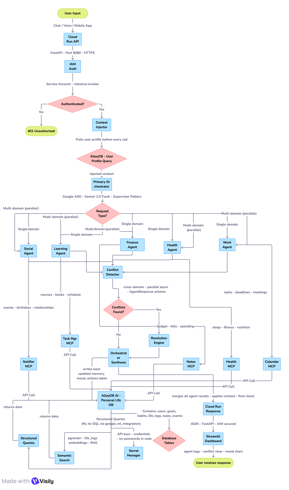

<div align="center">

# Saarthi AI
### सारथी — Your Personal Guide Through the Chaos of Modern Life

**Multi-Agent Personal Intelligence · Google ADK · AlloyDB AI · MCP · Cloud Run**

[](https://python.org)
[](https://google.github.io/adk-docs/)
[](https://cloud.google.com/alloydb)
[](https://cloud.google.com/run)
[](LICENSE)

> *Saarthi doesn't wait to be asked. It has already seen the conflict coming.*

**Built for GenAI Academy APAC Edition 2026 · Hack2skill × Google Cloud**

[Demo](#demo) · [Architecture](#architecture) · [Quickstart](#quickstart) · [Team](#team)

</div>

---

## What is Saarthi?

In the Mahabharata, a sarathi was not the warrior — but the guide who gave clarity at the moment of greatest conflict. **Saarthi AI is that guide for your daily life.**

The average person uses **9 productivity apps** that don't talk to each other. Your health app doesn't know your bank balance. Your calendar doesn't know you slept four hours. You become the bridge between your own tools — carrying context in your head that no single app can hold.

We call this **context-switching fatigue**.

Saarthi connects all of it. Five AI agents — Work, Health, Finance, Learning, Social — sharing one memory, firing in parallel, catching conflicts you would never notice alone.

It doesn't wait for you to ask. Every morning at 7am, it has already looked at your sleep, your calendar, and your mood — and it tells you what to change before your day goes wrong.

**Private. Data-backed. Built on Google Cloud.**

```
"I'm feeling burnt out today, what should I change?"

→ Work Agent:    7 tasks due, 2 are high-priority conflicts
→ Health Agent:  Avg sleep 5.8hrs past 5 days, mood 4.2/10
→ Finance Agent: No expensive commitments today
→ Social Agent:  Optional team dinner tonight — low-streak event
→ Saarthi:       Cancel tonight's dinner. Move 2 tasks to tomorrow.
                 Here is the data that proves why.
```

---

## Four Market Gaps Saarthi Closes

| Gap | Status Quo | Saarthi Edge |
|---|---|---|
| **Fragmentation** | Apps are siloed — health doesn't know your budget | 5-agent orchestrator shares a single AlloyDB memory |
| **Reactivity** | Siri and ChatGPT wait to be asked | Cloud Scheduler cron jobs trigger agents at 7am without a prompt |
| **Hallucination** | Generic advice with no data source | NL-to-SQL + Proof of Logic — every recommendation shows its receipts |
| **Privacy** | Big Tech trains on your life data | Your AlloyDB instance, your GCP project, zero-knowledge architecture |

---

## Architecture



### Technology Choices

| Layer | Technology | Why |
|---|---|---|
| Agent orchestration | Google ADK | Native A2A communication, sub-agent routing, no boilerplate |
| Tool connectivity | MCP | Future-proof — add Slack, Spotify, Notion in minutes |
| Personal database | AlloyDB AI | NL-to-SQL + pgvector RAG in one DB, no ETL pipeline needed |
| Deployment | Cloud Run | Serverless, scales to zero, IAM-native auth |
| Semantic memory | pgvector | Vector similarity search over life_logs for RAG |
| Secret management | Secret Manager | Zero passwords in code, ever |

---

## Features

### Cross-Domain Conflict Resolution
The orchestrator detects conflicts across all life domains simultaneously and resolves them using your actual habit data from AlloyDB — not generic rules.

```
INPUT:  "Train for 5K Tuesday 8am"
DETECTED: standup at 8:30am + avg sleep 5.8hrs + 18-day run streak
RESOLVED: Move run to Wednesday 6:30am (your highest-streak day)
PROOF:  Based on your last 18 days of habit data from AlloyDB
```

### Proactive Morning Briefing
Cloud Scheduler triggers agents at 7:00 AM without any user input. Saarthi analyzes sleep, calendar, tasks, and mood — and delivers a briefing before you ask.

### Proof of Logic
Every recommendation cites the exact AlloyDB data that produced it. No hallucinations. No generic advice.

```json
{
  "recommendation": "Based on your last 3 months of ₹4,200 avg food spending...",
  "proof": {
    "data_source": "AlloyDB · life_logs table",
    "query_period": "Last 3 months",
    "avg_monthly_spend": 4200.00,
    "confidence": "data-backed"
  }
}
```

### Semantic Life Search
Ask natural language questions about your own history using pgvector RAG.

```
"Find patterns in my mood from the last time I was preparing for a deadline"
→ Returns 5 semantically similar life_log entries with mood scores
→ Powered by Vertex AI text embeddings + pgvector cosine similarity
```

### Zero-Knowledge Privacy
Your data lives in your AlloyDB instance inside your GCP project. LifeOS never sees it. Delete everything with one command.

```sql
DELETE FROM life_logs WHERE user_id = 'your-id';  -- wipes all memory
```

---

## Project Structure

```
saarthi-ai/
├── agents/
│   ├── orchestrator.py          # Primary supervisor agent (Google ADK)
│   ├── work_agent.py            # Tasks, calendar, deadlines
│   ├── health_agent.py          # Sleep, fitness, nutrition
│   ├── finance_agent.py         # Budget, bills, spending
│   ├── learning_agent.py        # Courses, books, study
│   ├── social_agent.py          # Events, birthdays, relationships
│   ├── context_injector.py      # Pulls user profile before every call
│   ├── conflict_detector.py     # Cross-domain conflict rules engine
│   └── parallel_runner.py       # asyncio.gather() for all sub-agents
├── tools/
│   ├── calendar_mcp.py          # Google Calendar MCP wrapper
│   ├── tasks_mcp.py             # Task manager MCP
│   ├── notes_mcp.py             # Notes MCP
│   └── notifier_mcp.py          # SMS/email MCP
├── db/
│   ├── alloydb.py               # IAM-authenticated AlloyDB connector
│   ├── semantic_search.py       # pgvector RAG over life_logs
│   ├── proof_of_logic.py        # Data-backed recommendation engine
│   └── schema.sql               # Full database schema with pgvector
├── proactive/
│   └── morning_briefing.py      # Cloud Scheduler triggered briefing
├── security/
│   └── zero_knowledge.py        # Privacy model + GDPR erase endpoint
├── dashboard/
│   ├── app.py                   # Streamlit dashboard
│   └── requirements-dashboard.txt
├── docs/
│   ├── architecture.png         # System architecture diagram
│   ├── ADR.md                   # Architecture Decision Record
│   └── demo-script.md           # 3-minute demo walkthrough
├── tests/
│   ├── test_conflict_detector.py
│   ├── test_context_injector.py
│   └── test_alloydb_queries.py
├── main.py                      # FastAPI entrypoint
├── Dockerfile                   # API container
├── Dockerfile.dashboard         # Dashboard container
├── docker-compose.yml           # Local dev environment
├── cloud-scheduler.yaml         # Morning briefing cron job
├── cloudbuild.yaml              # CI/CD pipeline
├── requirements.txt             # API dependencies
├── .env.example                 # Environment variable template
├── .gitignore
└── README.md
```

---

## Quickstart

### Prerequisites
- Python 3.11+
- Docker + Docker Compose
- Google Cloud project with billing enabled
- `gcloud` CLI authenticated

### 1. Clone the repository

```bash
git clone https://github.com/Ajay-Kumar-Prasad/Saarthi-AI.git
cd saarthi-ai
```

### 2. Configure environment

```bash
cp .env.example .env
```

Edit `.env` with your values:

```env
ALLOYDB_INSTANCE_URI=projects/PROJECT/locations/REGION/clusters/CLUSTER/instances/INSTANCE
ALLOYDB_DB=saarthi
ALLOYDB_IAM_USER=saarthi-runner@PROJECT.iam.gserviceaccount.com
GOOGLE_CLOUD_PROJECT=your-project-id
GOOGLE_APPLICATION_CREDENTIALS=/secrets/sa-key.json
```

### 3. Run locally

```bash
docker-compose up
```

- API: `http://localhost:8080`
- Dashboard: `http://localhost:8501`
- Database: `localhost:5432`

### 4. Seed demo data

```bash
docker-compose exec api python db/seed.py
```

### 5. Test the conflict detection

```bash
curl -X POST http://localhost:8080/chat \
  -H "Content-Type: application/json" \
  -d '{"message": "I want to train for a 5K Tuesday 8am", "user_id": "demo-user"}'
```

---

## Deployment to Google Cloud

### IAM Setup (run once)

```bash
export PROJECT_ID="your-project-id"
export SA="saarthi-runner@$PROJECT_ID.iam.gserviceaccount.com"

# Create service account
gcloud iam service-accounts create saarthi-runner \
  --display-name="Saarthi AI Cloud Run Service Account"

# Grant required roles
gcloud projects add-iam-policy-binding $PROJECT_ID \
  --member="serviceAccount:$SA" --role="roles/alloydb.client"

gcloud projects add-iam-policy-binding $PROJECT_ID \
  --member="serviceAccount:$SA" --role="roles/aiplatform.user"

gcloud projects add-iam-policy-binding $PROJECT_ID \
  --member="serviceAccount:$SA" --role="roles/secretmanager.secretAccessor"

gcloud projects add-iam-policy-binding $PROJECT_ID \
  --member="serviceAccount:$SA" --role="roles/run.invoker"
```

### Deploy to Cloud Run

```bash
# Build and push container
gcloud builds submit --tag gcr.io/$PROJECT_ID/saarthi-api

# Deploy
gcloud run deploy saarthi-api \
  --image gcr.io/$PROJECT_ID/saarthi-api \
  --platform managed \
  --region us-central1 \
  --service-account $SA \
  --no-allow-unauthenticated \
  --set-env-vars GOOGLE_CLOUD_PROJECT=$PROJECT_ID
```

### Deploy Morning Briefing Cron

```bash
gcloud scheduler jobs create http saarthi-morning-briefing \
  --schedule="0 7 * * *" \
  --time-zone="Asia/Kolkata" \
  --uri="https://YOUR-CLOUDRUN-URL/proactive/morning-briefing" \
  --http-method=POST \
  --oidc-service-account-email=$SA
```

---

## Agent Response Contract

Every sub-agent returns this typed schema. The orchestrator rejects any response that does not conform.

```python
class AgentResponse(BaseModel):
    agent: str           # e.g. "health_agent"
    status: str          # "ok" | "error" | "partial"
    summary: str         # Human-readable result
    conflicts: list[str] # e.g. ["Low sleep + hard training = injury risk"]
    actions_taken: list[str]
    data: Optional[dict] # Raw data for orchestrator reasoning
```

---

## Security Model

```
Zero passwords in code — ever.

Authentication chain:
  User          →  Cloud Run        (HTTPS + OIDC token)
  Cloud Run     →  AlloyDB          (IAM connector, service account)
  Cloud Run     →  Secret Manager   (service account, scoped access)
  Cloud Run     →  Vertex AI        (service account, aiplatform.user)

Data residency:
  AlloyDB runs in YOUR GCP project.
  Saarthi never has access to raw user data.
  Embeddings in pgvector cannot be reverse-engineered to plaintext.

GDPR erase:
  DELETE /user/{user_id}/all-data  →  wipes all 6 tables instantly.
```

---

## Architecture Decision Record

See [`docs/ADR.md`](docs/ADR.md) for the full justification of every technology choice.

**Summary:**
- **AlloyDB over Cloud SQL** — built-in ML functions for NL-to-SQL without ETL
- **MCP over custom wrappers** — any new tool integrates in minutes, not days
- **Google ADK over LangChain** — native A2A, sub-agent routing, no boilerplate
- **Cloud Run over GKE** — scale to zero, IAM-native, zero cold-start config
- **pgvector over Pinecone** — semantic search in the same DB as structured data

---

## Demo

**The 90-second judge demo:**

1. Open the Streamlit dashboard at `http://localhost:8501`
2. Click the prompt: *"I'm feeling burnt out today, what should I change?"*
3. Watch 5 agents fire in parallel in the activity log panel
4. See the cross-domain conflict detected between task load and mood score
5. Read the resolution with proof-of-logic data receipt

**Expected output:**
```json
{
  "summary": "You have 7 tasks due but your mood is 4.2/10 and sleep avg is 5.8hrs.",
  "resolution_steps": [
    "Cancel tonight's optional team dinner (low-streak social event)",
    "Move 2 non-critical tasks to tomorrow",
    "Protect 8am–10am as uninterrupted recovery time"
  ],
  "proof": {
    "mood_data": "4.2/10 avg over 7 days",
    "sleep_data": "5.8hrs avg over 5 days",
    "task_data": "7 tasks due, 3 high-priority"
  }
}
```

---

## Team

| Member | GitHub | Focus |
|---|---|---|
| Ajay Kumar Prasad | [Ajay-Kumar-Prasad](https://github.com/Ajay-Kumar-Prasad) | Learning Agent |
| Hariharan S | [vldzio](https://github.com/vldzio) | Work Agent |
| Joshna Ch | [ChJoshna](https://github.com/ChJoshna) | Health Agent |
| Shubham Negi | [shubham5557](https://github.com/shubham5557) | Finance Agent |

**Built at:** GenAI Academy APAC Edition 2026 · Hack2skill × Google Cloud

---

## License

MIT License — see [LICENSE](LICENSE) for details.

---

<div align="center">

**Saarthi AI** — Because your life deserves a guide, not nine apps that don't talk to each other.

*सारथी · The one who gives you clarity when life gets complicated.*

</div>